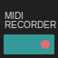

# MIDI Recorder

[](https://github.com/t0mg/midi-recorder/actions/workflows/deploy.yml)

A simple web-based application for recording, playing, saving, and exporting MIDI data from MIDI devices over USB. It is useable directly from https://t0mg.github.io/midi-recorder/

This small app was a weekend experiment made entirely on a phone using [AI studio](aistudio.google.com), [Jules](jules.google.com), and a pinch of tedious manual editing.

## Features

- Connect to MIDI input and output devices.
- Record MIDI performances.
- Playback recorded MIDI data.
- Save recordings in the browser's local storage.
- Export recordings as MIDI files (`.mid`).
- Import MIDI files.
- Auto-record on MIDI input.

## How to build and run

This project uses [Vite](https://vitejs.dev/) for development and building.

To run the app in development mode:

```bash
npm install
npm run dev
```

To create a production build:

```bash
npm install
npm run build
```

To preview the production build:

```bash
npm run preview
```

## Credits & Technologies Used

The project uses the following APIs and libraries:

*   **External Libraries**:
    *   [@tonejs/midi](https://github.com/Tonejs/Midi): For parsing and creating MIDI files.
*   **Browser APIs**:
    *   [Web MIDI API](https://developer.mozilla.org/en-US/docs/Web/API/Web_MIDI_API): For connecting to and receiving messages from MIDI devices.
    *   [Web Storage API](https://developer.mozilla.org/en-US/docs/Web/API/Web_Storage_API): For saving and loading recordings in the browser.
    *   [Screen Wake Lock API](https://developer.mozilla.org/en-US/docs/Web/API/Screen_Wake_Lock_API): For preventing the screen from dimming or locking during use.

## License

This project is licensed under the Apache License, Version 2.0. See the `LICENSE` file for details.
